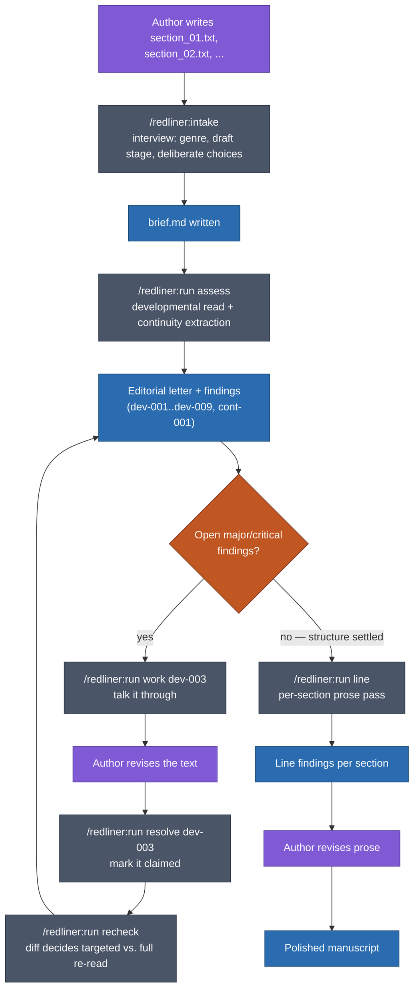

# redliner

A layered long-form-editing tool that runs as a Claude Code plugin —
developmental editing, line editing, and a cross-cutting continuity
checker, each running as its own subagent against your manuscript.
Built first for fiction, which stays the primary use case, but the
category vocabulary is domain-driven, so it also works on design docs
and product proposals today, and on anything else `/redliner:new-domain`
can be walked through designing.

## What it does

Three layers, run separately rather than as one pass:

1. **Developmental editing** — reads the *whole* manuscript at once,
   flags whole-document structural issues (for fiction: plot, pacing,
   character arcs, structure, stakes, theme; for a design doc: problem
   justification, alternatives considered, risk coverage, scope,
   success criteria, stakeholder impact). Iterative: runs in rounds,
   tracks which findings you've addressed, and re-checks after revision.
2. **Line editing** — reads *one section at a time*, flags detail-level
   issues (for fiction: rhythm, voice, show-vs-tell, dialogue, POV, word
   choice; for a design doc: clarity, jargon, passive voice, redundancy,
   flow). Gated behind developmental work settling — see below.
3. **Continuity** — cross-cutting, runs alongside either phase. Extracts
   checkable facts per section, finds contradictions mechanically
   (same entity, same attribute, different value — computed exactly, not
   guessed at), then has an agent judge only the collisions found: real
   error vs. a lying character (or, for a design doc, a summary
   legitimately simplifying a detail) vs. an edit you made in one
   section that hasn't propagated to another yet.

Which category vocabulary applies comes from the manuscript's **domain**
— see "Domains" below. Every finding, in any domain, carries an `id`, a
`status` (open/claimed/addressed/stale/wontfix), a `category`, and a
`severity`.

An **intake interview** (`/redliner:intake`) runs first and produces a
persistent brief — the domain's own fields (genre and comps for fiction;
audience and decision authority for a design doc), draft stage, and a
*deliberate choices* list, because an editor that doesn't know your
intent will report your choices as your mistakes.

## Why phases are sequential

Developmental editing iterates until structure settles; line editing
comes after. A combined pass produces contradictory advice about the
same paragraph — recommending it be deleted while also giving it
sentence-level rewrites. That happened in an early version of this tool,
which is why the phases are now enforced separately rather than left as
a suggestion.

## Setup

Two plugin variants exist in this one repo, because Cowork and the
Claude Code CLI have genuinely different constraints on how a plugin is
allowed to run its deterministic logic — see "Two plugin variants"
below for why. Install the one matching where you'll actually use it.

**Claude Code CLI** — nothing to install beyond Claude Code itself. Load
the plugin from whatever directory holds the manuscript you want to work
on:

```
claude --plugin-dir /path/to/redliner
```

Or install it once, permanently:

```
claude plugin marketplace add tcotav/redliner
claude plugin install redliner@redliner
```

**[Claude Cowork](https://claude.com/docs/cowork/overview)** — a
GUI/desktop surface rather than a terminal, likely a better fit for a
non-technical author. Install `redliner-cowork` (not `redliner` — the
CLI variant is rejected by Cowork's content policy, see below):

```
claude plugin marketplace add tcotav/redliner
claude plugin install redliner-cowork@redliner
```

In Cowork's own UI, the equivalent is **Customize → Plugins → Add
marketplace**, entering `tcotav/redliner`, then installing
**`redliner-cowork`** specifically from the list that appears.
`.claude-plugin/marketplace.json` at this repo's root is what makes
`tcotav/redliner` resolve at all — it's what both `claude plugin
marketplace add` and Cowork's "Add marketplace" look for, and it lists
both variants.

No runtime dependencies — no Python, no `pip install`, no build step.
Both variants run a single self-contained Go binary, downloaded for your
platform on first session start by a `SessionStart` hook (checksum
verified; it refuses to install anything that doesn't match). Currently
built for **darwin/arm64 only** — other platforms need a build added to
`.github/workflows/release-go-binaries.yml`.

### Two plugin variants, one shared core

`redliner` (CLI variant, this repo's root) runs its deterministic logic
— state tracking, hashing, schema validation — as bare executables in
`bin/`, added to the Bash tool's PATH while the plugin is enabled.
Cowork's own content policy explicitly rejects that shape: a plugin
that ships a top-level `bin/` directory of PATH-executables is refused
at "Add marketplace" time, because that mechanism is invisible to
whatever review surface an org admin uses to approve a plugin.

`redliner-cowork` (`cowork/` in this repo) is the same tool, same
`agents/`, same `skills/`, same underlying Go binary (shared, not a
fork) — but exposes the deterministic
operations as an MCP server instead of PATH executables, which Cowork
does allow. Every skill file is written to describe what it needs
("check the manuscript's current state") rather than exact command
syntax, so the identical skill prose correctly drives either the CLI's
bare commands or the MCP tools, whichever this session actually has.
See `TODO.md`'s "Cowork support via an MCP server variant" section for
the full story, including two real bugs this surfaced and fixed.

## Run

```
/redliner:intake                 # first time only, or to revise the brief (asks which domain, if more than one)
/redliner:run assess             # developmental pass (also runs continuity at the end)
/redliner:run work dev-003       # talk through one finding
/redliner:run resolve dev-003    # mark it addressed (your claim)
/redliner:run recheck            # verify claims after revision (also re-runs continuity)
/redliner:run line               # line-editing phase (soft-gated on open major/critical findings)
/redliner:run continuity         # extract facts, find collisions, adjudicate — standalone or automatic
/redliner:run status             # where things stand
/redliner:new-domain             # design a new kind of document to edit (see "Domains" below)
```

Manuscript directories are one file per section, named `section_01`,
`section_02`, ... and read in sorted filename order. Either plain `.txt`
or `.md` — pick one per section; the same stem can't exist as both.
Defaults to the current directory if no path is given.

Validate a manuscript's `.redliner/` output directly, without running a
full pass:

```
redliner validate <manuscript_dir>
```

### A manuscript's path through this, end to end



The loop in the middle (`work` → revise → `resolve` → `recheck`) is the
point, not an inconvenience — see "Why phases are sequential" above.
Most manuscripts go around it several times before structure settles
enough to reach `line`. `/redliner:run continuity` runs alongside
`assess` and `recheck` rather than as its own step here; its
contradictions land in the same letter developmental findings do.

## Architecture

```
redliner/                          (plugin root)
├── .claude-plugin/plugin.json
├── agents/                       five subagents per domain (Task tool targets)
│   ├── fiction-developmental-editor.md
│   ├── fiction-line-editor.md
│   ├── fiction-editorial-aggregator.md
│   ├── fiction-continuity-extractor.md
│   ├── fiction-continuity-adjudicator.md
│   ├── design-doc-*.md           (same five roles, design-doc's own vocabulary)
│   └── serial-fiction-*.md       (same five roles, episodic-fiction vocabulary)
├── skills/
│   ├── run/SKILL.md              /redliner:run <status|assess|work|resolve|recheck|line|continuity>
│   ├── intake/SKILL.md           /redliner:intake
│   └── new-domain/
│       ├── SKILL.md              /redliner:new-domain — design + generate a domain
│       └── reference/templates/  FIXED/AUTHORED templates for the five agent roles
├── domains/                      vocabulary per kind of document (see below)
│   ├── fiction/domain.json
│   ├── design-doc/domain.json
│   └── serial-fiction/domain.json
├── bin/                          on PATH while the plugin is enabled
│   └── redliner                  single Go binary, all operations below.
│                                 Not committed — downloaded per-platform by
│                                 hooks/bootstrap-redliner-binary.sh from the
│                                 GitHub Release matching plugin.json's version
├── hooks/
│   ├── hooks.json                SessionStart: fetches bin/redliner
│   └── bootstrap-redliner-binary.sh   verifies checksum, refuses on mismatch
├── sample_manuscript/            two-section fixture with seeded issues
├── .github/workflows/            release-go-binaries.yml — cross-compiles
│                                 and publishes what the hooks download
├── go/                           the implementation
│   ├── cmd/redliner/             CLI + `redliner mcp` (both front doors, one binary)
│   ├── internal/schemas/         state, domain loading, validators
│   ├── internal/cli/  internal/mcpserver/
│   └── harness/                  differential harness (see go/harness/README.md)
│       ├── python-baseline/      the frozen pre-port Python, kept as the oracle
│       │                         the goldens are captured from. Off PATH, not
│       │                         shipped as a front door, not maintained.
│       └── golden/               captured baselines the Go tests diff against
└── cowork/                       (plugin root #2 — see "Setup" above)
    ├── .claude-plugin/plugin.json   declares mcpServers (the Go binary), no bin/
    ├── hooks/                       SessionStart: fetches the binary into
    │                                ${CLAUDE_PLUGIN_DATA}/bin/
    ├── agents -> ../agents          symlinks: one shared core, not a fork
    ├── skills -> ../skills
    └── domains -> ../domains
```

State lives with the manuscript, not with the tool: every manuscript
directory gets its own `<manuscript_dir>/.redliner/` (state, brief,
findings, canon), so redliner works across multiple manuscripts and a
manuscript's editing history travels with it if you move or back it up.

### Domains: not fiction-only

`redliner` started fiction-specific, but the engine (state machine,
schemas, validators) doesn't know what "fiction" means anymore — only
the active **domain** does. A manuscript's `.redliner/state.json` carries
a `domain` field (defaults to `fiction`); the binary's domain loader
loads `domains/<name>/domain.json` for that manuscript and everything
downstream (allowed categories for developmental/line findings, the
continuity layer's entity types/sources/categories, `/redliner:intake`'s
questions, which phase tracks revision rounds) comes from that file
rather than being hardcoded.

Three domains exist today: `fiction`, `design-doc` (design docs /
product proposals), and `serial-fiction` (fiction released in
installments — a web serial, a Substack/Patreon serial — where a
chapter is read both on its own and as part of an ongoing whole). Each
domain also has its own five agent files in `agents/`
(`agents/fiction-*.md`, `agents/design-doc-*.md`,
`agents/serial-fiction-*.md`) — a domain is config plus a matching set
of generated prompts, not config alone; see "Why this is static, not
runtime-injected" below.

**To add a domain, run `/redliner:new-domain`.** It interviews you
through the design (category vocabulary for both editing phases, the
continuity layer's entity types/sources/categories, brief fields, draft
stages), enforces guardrails on the category design (4–7 categories per
phase, each one a reviewer could plausibly disagree about being
present, none redundant with severity), writes `domain.json`, generates
the five agent files, and verifies all of it — including a live check
that each generated agent actually registers under its expected name —
before calling it done.

#### `domain.json` format, for hand-editing

Every domain is one JSON file at `domains/<name>/domain.json`, loaded
and validated by `go/internal/schemas/domain_loader.go`. All keys below
are required — `redliner domain show <name>` will say exactly what's
missing if not:

| Key | Shape | What it controls |
|---|---|---|
| `name` | string | Must match the directory name. |
| `display_name` | string | Shown when `/redliner:intake` offers a choice of domains. |
| `description` | string | One sentence; also shown in that choice. |
| `round_tracked_phase` | string | Fixed to `"developmental"` for every domain — see `TODO.md` for why this isn't domain-configurable. |
| `unit_name` | string | Fixed to `"section"` — descriptive only today; the `section_<NNN>` naming convention is still hardcoded in `go/internal/schemas/project_state.go` (the file extension isn't — `.txt` and `.md` are both supported). |
| `developmental_categories` | list of strings | Allowed `category` values for whole-document findings. 4–7, each independently disputable, none a severity in disguise. |
| `line_categories` | list of strings | Same rules, for single-section findings. |
| `continuity.entity_types` | list of strings | What kinds of things get checkable facts extracted about them. |
| `continuity.sources` | list of strings | Where an assertion comes from, ordered by nothing but distinguished by authority/reliability (fiction: narration vs. a lying character; design-doc: body vs. a simplifying summary). |
| `continuity.categories` | list of strings | What *kind* of contradiction a collision represents. |
| `brief_fields` | list of `{name, label, prompt}` | What `/redliner:intake` asks before any pass runs. `name` is the internal key, `label` is used in the brief template, `prompt` is the literal question. |
| `draft_stages` | list of `{name, implication}` | Ordered draft-stage vocabulary; `implication` is copied verbatim into the brief and read by every pass to calibrate severity. |

A domain with `domain.json` but no matching `agents/<name>-*.md` files
is incomplete — the config alone doesn't make the passes work, since
each agent's role framing and worked examples have to actually be
written for that domain. `/redliner:new-domain` is the intended way to
get both in sync; if hand-editing an existing domain's `domain.json`
(e.g. adding a category), update the matching agent file's category
list and output-format example too — nothing enforces that they agree
beyond the schema validator checking findings *after* the fact.

#### Why this is static, not runtime-injected

The alternative design — generic agent prompts that read category
vocabulary out of `domain.json` at runtime, so one prompt serves every
domain — was considered and rejected. The agent files are the
best-engineered part of this system (real iterated prompt craft, e.g.
`fiction-developmental-editor.md`'s handling of `deferred_to_line`);
runtime injection would hollow that out into generic text, and it would
concentrate every future bug in one prompt-construction step instead of
in reviewable, diffable, per-domain files. `/redliner:new-domain`
generates static files for exactly this reason — regenerate them when a
domain's design changes, hand-edit them after.

A few things worth knowing if you're debugging or extending this:

- **Findings are files, not just chat output.** Each subagent writes a
  JSON file with the `Write` tool rather than putting its findings only
  in its final reply — durable, inspectable, and checkable by
  `redliner validate` between steps.
- **Nothing here enforces JSON shape at the API level.** A subagent is
  *told* the schema and could still get it wrong, so
  `redliner validate` checks after the fact — including verifying
  that any `excerpt` field is a genuine verbatim substring of the section
  it claims to quote, not a paraphrase. That check has already caught a
  real fabricated excerpt in this repo's own sample data.
- **Deterministic detection, model judgment — kept as two separate
  steps.** Section-hash diffing and continuity-collision finding are both
  exactly computable, so they're plain scripts. Judgment (is this really
  a contradiction?) only happens after, on what the script already found.
- **Developmental passes run unattended.** Subagents have no tool to ask
  you anything mid-pass. Ambiguity your brief doesn't resolve gets
  picked, proceeded on, and recorded in an `assumptions` list instead of
  guessed at silently — this has already surfaced a real
  self-contradiction in this repo's own sample brief.
- **Subagents must be referenced by their plugin-namespaced,
  domain-prefixed name** (`redliner:fiction-developmental-editor`, not
  `developmental-editor` or even `redliner:developmental-editor`)
  anywhere `SKILL.md` invokes the Task tool. Two real bugs were caught
  here by an actual plugin load test, not by static checking: a bare
  name fails outright, and — less obviously — **the registered agent id
  comes from the `name:` field in an agent file's frontmatter, not the
  filename.** Renaming `agents/developmental-editor.md` to
  `agents/fiction-developmental-editor.md` alone did nothing; the
  frontmatter `name:` had to be changed too. Every domain's agent files
  follow `agents/<domain>-<role>.md` with a matching `name:
  <domain>-<role>` in frontmatter — both, not just the filename.

### Known gap: the permission allowlist doesn't travel with the plugin

Claude Code plugin-root `settings.json` only honors the `agent` and
`subagentStatusLine` keys — not permission rules. So the allowlist that
stops `bin/redliner` from triggering a permission prompt on every call
can't ship inside the plugin. Add this to your own project or user
`settings.json` if you want that:

```json
{
  "permissions": {
    "allow": [
      "Bash(redliner *)"
    ]
  }
}
```

## Status

Working end to end against `sample_manuscript/` (a bundled two-section
test fixture with deliberately seeded issues — not a model for where
your own manuscript should live) through all three layers. The plugin
structure itself has been verified with a real `claude --plugin-dir`
load against a scratch manuscript with no relationship to this repo, not
just statically — that test caught and fixed the bare-vs-namespaced
subagent bug mentioned above.

A full `/redliner:intake` → `/redliner:run assess` pass has now been run
through the real Task-orchestrated pipeline, start to finish, on a fresh
three-section manuscript written for the purpose with no relationship to
this repo. Intake and both passes completed; the draft-stage gate
correctly suppressed line findings; the continuity adjudicator correctly
dismissed two false positives on its own. It also found a real bug in
the continuity layer — contradictions are missed when two sections'
extractions name the same thing differently (`tide clock` vs `the tide
clock`) — which is written up in `TODO.md` and **not yet fixed**.

**That run took ~13.5 minutes for ~750 words**, and scales with section
count, so expect a full manuscript to take considerably longer.
`/redliner:run` now states the step list and a rough duration before any
long pass starts, and reports each step as it completes, so a long
silent stretch is distinguishable from a hang.

That run also spent ~45K output tokens across 113 API calls, with prompt
caching accounting for a ~74% reduction in token cost. `TODO.md` has the
per-step breakdown. Note the agents specify `model: inherit`, so passes
run on whatever model your session uses — that choice affects cost more
than anything else, and on a Pro/Max subscription usage draws against
plan limits rather than being billed per token.

**The Go port is done and merged.** Every deterministic operation —
both front doors, CLI and MCP — is one statically-linked binary with no
runtime dependencies, replacing the original Python. It was ported
against a differential harness built *before* any Go existed: 23
captured operation sequences across four fixtures, diffed against the
real Python implementation rather than against a read-through of the
ported code. That Python is kept, frozen, at
`go/harness/python-baseline/` as the oracle those baselines are captured
from. `go test ./...` covers the CLI, the MCP server, and the schema
layer against those goldens.

Distribution is download-on-install: `.github/workflows/release-go-binaries.yml`
cross-compiles on a tag push and attaches the binary plus `checksums.txt`
to a GitHub Release, and each plugin's `SessionStart` hook fetches the
asset matching its own `plugin.json` version, verifying the checksum and
refusing to install on mismatch. No binary is committed to this repo.

**Cowork support (see "Setup" above) is done.** A second plugin variant
(`redliner-cowork`) exposes the same 10 deterministic operations as MCP
tools instead of `bin/`-on-PATH, which Cowork's content policy otherwise
rejects outright. Verified for real, not just locally: installed in
actual Cowork, a real tool call answered correctly. One shared set of
skill/agent files, phrased by intent, drives either the CLI or MCP
variant — proven by a live spike before committing to that design, not
assumed. See `TODO.md`'s "Cowork support via an MCP server variant"
section for the two real bugs that build caught (a path-traversal import
bug only a real install-cycle test surfaced, and a dependency-bootstrap
gap).

An earlier caveat here — that first use might need one MCP server
restart — is **gone with the venv it came from**. Verified 2026-08-12
across seven clean uninstall → reinstall → session cycles from a real
GitHub-hosted marketplace: both plugins' hooks fetched their binary 7/7,
and the Cowork MCP server reported connected with no restart. `TODO.md`
records why the reliability problem this replaced turned out to be a
measurement artifact rather than a real bug.

**Domain generalization (see "Domains" above) is done.** The engine
loads category vocabulary from `domains/<name>/domain.json` instead of
hardcoding fiction's; `/redliner:new-domain` designs and generates a new
domain's config and agent files; `/redliner:intake` reads its questions
from whichever domain is active instead of hardcoding fiction's. Two
more real domains exist beyond fiction: `design-doc`, verified two ways
— its `domain.json` and a hand-built findings/canon fixture (the
concrete "the summary says Q3, the timeline section says Q4" test case)
both pass the schema validator with zero model calls (then
`validate_findings.py`, now `redliner validate`) — and
`serial-fiction`. Every domain's five generated agents (fifteen total
across the three) were confirmed live (`claude --plugin-dir`) to
actually register and respond under their expected `redliner:<domain>-*`
ids — not just read back as plausible-looking files.

**Three smaller things added alongside the domain work, each verified
live, each catching a real bug in the process:**

- **`.md` section files, alongside `.txt`.** Extension is picked per
  manuscript (mixing across *different* section stems is fine; the same
  stem existing as both is rejected as ambiguous). Live testing against
  a real `.md` fixture caught a genuine gap: the excerpt-verbatim check
  only normalized whitespace, so an agent quoting `**relentless**` as
  `relentless` (correct — the words are what's verbatim, not the
  markup) failed the check on a technicality. Fixed by stripping
  markdown emphasis/code delimiters symmetrically from both sides of the
  comparison before matching — a change that can only make a genuine
  quote match, never make a fabricated one match, since that still
  requires the wording itself to differ.
- **Optional required-structure checking for `design-doc`.** A
  `required_structure` brief field plus a `structure_compliance`
  developmental category (only fires when the field is non-empty — it
  never invents a template the author didn't specify). Confirmed live
  against a doc deliberately missing half its team's required sections:
  correctly flagged the three missing sections under
  `structure_compliance`, distinct from `alternatives_considered`
  (missing *content*) reported separately — the two didn't collapse into
  one vague finding. The blank-field path (no findings when no structure
  was given) is a direct read of an explicit prompt instruction, not
  separately live-tested — lower risk than the positive case, but worth
  being honest that only one branch was actually run.
- **A `release_format` brief field on the base `fiction` domain**
  (standalone / series / serialized). This exists because it was missed
  once for real: a developmental pass, without this context, flagged a
  serialized manuscript's intentionally-open chapter endings as
  structural gaps. Verified with a controlled live test — identical
  two-section text assessed twice, differing only in this one brief
  field: the `serialized` run raised nothing about the unresolved
  thread; the `standalone` run explicitly reasoned that, since the brief
  ruled out serial/episodic format, the same unresolved setup "reads as
  an unfinished fragment rather than an intentional hook," and folded
  that into a `critical` finding about the manuscript's length and
  completeness. The field changed the reasoning, demonstrably — the
  fixture (two ~50-word sections) was too short for that to be the only
  variable in play, so treat this as strong evidence the field works as
  intended, not as an isolated clean A/B result.

**The continuity layer is wired into `/redliner:run`.** `/redliner:run
continuity` (standalone, and run automatically by both `assess` and
`recheck`, its summary shown after their developmental letter) extracts
facts from whatever sections changed, reconciles deterministically, and
adjudicates only if a collision was actually found — skipping the
adjudicator entirely (no model call) when there's nothing to judge.
Verified live end to end, not against a hand-built fixture: a real
two-section manuscript with a deliberately planted contradiction (an eye
color stated two ways) went through extraction and adjudication by the
actual agents, the schema validator passed (then `validate_findings.py`,
now `redliner validate`) including the
excerpt-verbatim check against text the agents chose themselves (not
text a fixture author copied by hand), a matching clean manuscript
confirmed the zero-collision path writes `{"contradictions": []}`
directly without invoking the adjudicator, and a real `assess` → edit →
`recheck` cycle confirmed `likely_unpropagated_revision` fires correctly
— which also caught a real ordering bug before it shipped (continuity's
`reconcile` has to run *before* `snapshot`, not after, or the
revision-detection diff always comes back empty; see `TODO.md`).

Known limitation, not an oversight: contradiction ids and `status` don't
carry forward across `recheck` runs the way developmental findings do —
a fixed-then-recurring collision gets a new id rather than reusing the
old one. Deferred deliberately; see `TODO.md` for the design already
sketched for it (a script-computed carry-forward, not a model guessing
at a diff).

(Separately, the pre-existing permission-allowlist gap below also needed
`redliner_domain.py` added wherever it's copied. Moot since the Go port:
there is one command name now, `redliner`, so the allowlist no longer
grows a line per script.)

Other open items in `TODO.md`: read-only Obsidian vault integration as
a second source of canon, and carrying contradiction ids forward across
`recheck` runs (above).
