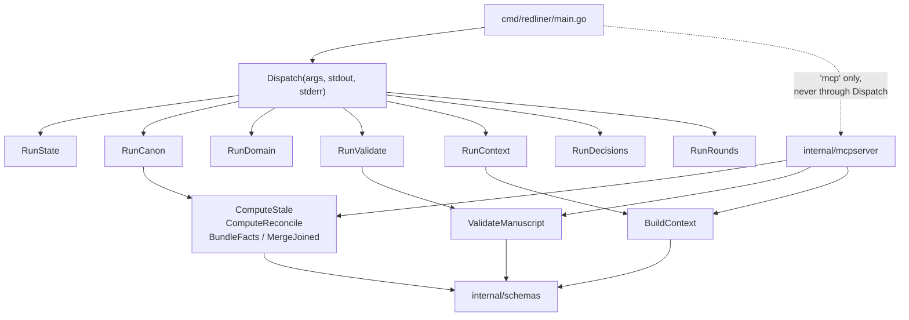
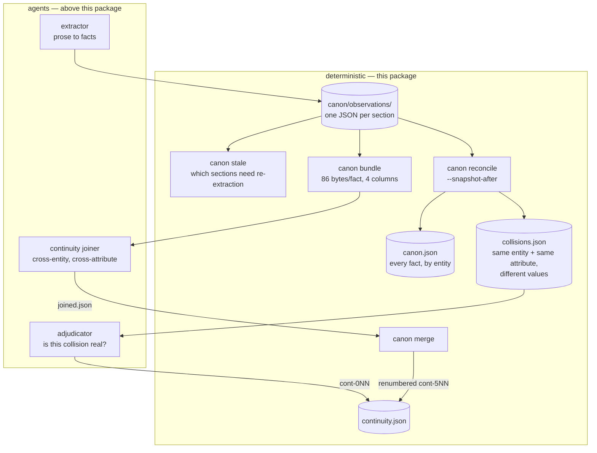

# redliner go/internal/cli — a walkthrough

*2026-08-15T22:34:34Z by Showboat 0.6.1*
<!-- showboat-id: 103be5c0-4743-4bc5-b196-2ea8616e17ad -->

> Every `bash` block below re-executes and reproduces its recorded output.
> `showboat verify` nonetheless exits 1 on this file: it tries to execute
> *every* fenced block by language, including the two ```` ```mermaid ````
> diagrams. Neutralize those two fences and it exits 0.

## What this package is

`go/internal/cli` is redliner's **deterministic layer** — the part that is
plain Go with no model in the loop. Everything an agent does (reading prose,
judging a contradiction, writing a letter) happens above it; everything this
package does is bookkeeping the agents can be held to: what state a manuscript
is in, which sections changed, which facts disagree with each other, whether a
findings file is well-formed.

It is roughly 3,300 lines across 20 files, about a third of it tests. It has
**two front doors** — the `redliner` CLI and an MCP server for the Cowork
plugin variant — and a recurring structural theme falls straight out of that:
nearly every operation is split into a *pure computation* and a *printing
wrapper*, so both doors share the computation and never drift.

This walkthrough reads it in dependency order: the router, the shared helpers,
the simple commands, then `canon.go`, which is where the real complexity lives.

## The shape of the whole package



Two things to notice before reading a line of code.

**The exported/unexported split is not stylistic.** `ComputeStale` is exported
and `cmdCanonStale` is not, because the MCP server calls the first and the CLI
calls the second. Anything exported from this package is exported *because
internal/mcpserver needs it* — that is the whole rule.

**`mcp` is dispatched in `main.go`, not here.** `internal/mcpserver` imports
`internal/cli`, so `internal/cli` cannot import it back. The router's own
comment says so.

```bash
sed -n "20,51p" go/internal/cli/dispatch.go
```

```output
// Dispatch is the binary's top-level subcommand router for every
// subcommand *except* "mcp", shared by cmd/redliner/main.go and this
// package's own tests. "mcp" is handled by main.go directly, not here:
// internal/mcpserver imports internal/cli (mirroring
// mcp_server.py importing straight into schemas/ and reusing
// redliner_canon.py's/validate_findings.py's functions), so this
// package cannot import internal/mcpserver back without a cycle.
func Dispatch(args []string, stdout, stderr io.Writer) int {
	if len(args) < 1 {
		fmt.Fprintln(stdout, usage)
		return 1
	}
	switch args[0] {
	case "state":
		return RunState(args[1:], stdout)
	case "canon":
		return RunCanon(args[1:], stdout, stderr)
	case "domain":
		return RunDomain(args[1:], stdout, stderr)
	case "validate":
		return RunValidate(args[1:], stdout)
	case "context":
		return RunContext(args[1:], stdout)
	case "decisions":
		return RunDecisions(args[1:], stdout)
	case "rounds":
		return RunRounds(args[1:], stdout)
	default:
		fmt.Fprintf(stdout, "Unknown subcommand %s\n\n%s\n", pyReprStr(args[0]), usage)
		return 1
	}
}
```

Every `Run*` takes an `io.Writer` and returns an `int` exit code — it never
touches the real `os.Stdout` and never calls `os.Exit`. That is what lets
`golden_test.go` run the entire CLI in-process against captured fixtures
instead of shelling out.

Two of them take `stderr` as well, `RunDomain` and `RunCanon`, and in both
cases for the same narrow reason: they have something to say that must not
land in stdout. We'll get to both.

## util.go — the shared helpers, and a Python ghost

This package is a port. `bin/redliner_state.py`, `redliner_canon.py`,
`redliner_domain.py` and `validate_findings.py` came first, and a differential
harness still checks the Go against captured Python output. That explains a set
of helpers that would otherwise look eccentric:

```bash
sed -n "96,115p" go/internal/cli/util.go
```

```output
// pyReprStr / pyListRepr approximate Python's repr() for the small set
// of shapes these commands' error/summary messages actually use --
// mirrors schemas' unexported pyRepr/pyList (not reused directly since
// those are internal to the schemas package and this is a narrow,
// separate need).
func pyReprStr(s string) string {
	return "'" + strings.ReplaceAll(s, "'", "\\'") + "'"
}

func pyListRepr(items []string) string {
	sorted := append([]string(nil), items...)
	// Callers pass already-sorted distinct_values; sort again defensively
	// so this helper is correct standalone too.
	sort.Strings(sorted)
	quoted := make([]string, len(sorted))
	for i, s := range sorted {
		quoted[i] = pyReprStr(s)
	}
	return "[" + strings.Join(quoted, ", ") + "]"
}
```

Go is emitting `'fiction'` and `['blue', 'green']` — Python's `repr()`, not
Go's `%q` or `%v` — because those exact strings are compared byte-for-byte
against golden output captured from the Python original.

Two more helpers in the same file encode small deliberate decisions:

- **`orEmptyStrings`** forces a `nil` slice to marshal as `[]` rather than
  `null`. Purely for the harness's JSON comparison, but it also means no
  consumer ever has to distinguish "no sections" from "field absent".
- **`loadJSON`** returns a *synthetic object carrying the error* on a parse
  failure (`{"__parse_error__": "..."}`) instead of propagating it. The
  validators then reject that object through their normal "not a JSON object"
  path. The comment is candid that this is **stricter than the Python
  original**, which crashed the whole validate run on one malformed file.

## state.go — the manuscript's ledger

`state init | status | diff | snapshot | phase | stage | pass`. Most of it is
straightforward load-mutate-save. Three things are worth stopping on.

**`requireState` is the universal gate**, and its message is a documented
divergence from Python:

```bash
sed -n "81,92p" go/internal/cli/state.go
```

```output
func requireState(manuscriptDir string, stdout io.Writer) (*schemas.State, bool) {
	state, err := schemas.LoadState(manuscriptDir)
	if err != nil {
		fmt.Fprintf(stdout, "Error reading state: %v\n", err)
		return nil, false
	}
	if state == nil {
		fmt.Fprintf(stdout, "No redliner state in %s. Run: redliner state init %s\n", manuscriptDir, manuscriptDir)
		return nil, false
	}
	return state, true
}
```

The message names the *new* invocation (`redliner state init`), not Python's
`redliner_state.py init`. This is the single exception in the golden test —
listed there by name, in a map called `knownDivergentStdout`, rather than
waved through by exit code. We'll see that map later; the way it's scoped is
the interesting part.

**Phases and passes are different sets, and conflating them was a real bug:**

```bash
sed -n "208,210p;264,281p" go/internal/cli/state.go
```

```output
// passKinds are the passes an author can actually run. Deliberately
// distinct from schemas.Phases -- see cmdStatePass for why.
var passKinds = []string{"developmental", "line", "continuity"}
func cmdStatePass(manuscriptDir, kind string, stdout io.Writer) int {
	// Deliberately NOT validated against schemas.Phases. The pass kinds
	// and the phases are different sets: `continuity` is a real pass that
	// is explicitly not phase-gated (it tracks its own per-section
	// staleness), while `intake` and `complete` are phases nobody runs a
	// pass of. Validating against Phases rejected `continuity` and
	// accepted `intake`, both wrong.
	valid := false
	for _, k := range passKinds {
		if k == kind {
			valid = true
			break
		}
	}
	if !valid {
		fmt.Fprintf(stdout, "Unknown pass %s. Must be one of: %s\n", pyReprStr(kind), strings.Join(passKinds, ", "))
		return 1
	}
```

Two overlapping vocabularies that are *almost* the same set is exactly the kind
of thing a reviewer flags as duplication. The comment pre-empts it with the
failure it actually produced: validating against `Phases` rejected `continuity`
(a real pass) and accepted `intake` (a phase nobody runs a pass of).

Hold onto that distinction — it comes back in `rounds.go`, where forgetting it
cost real data.

**The round counter advances on a phase transition, and the phase name comes
from domain config rather than a hardcoded string:**

```bash
sed -n "189,199p" go/internal/cli/state.go
```

```output
	roundTrackedPhase := domain.RoundTrackedPhase()

	previous := state.Phase
	state.Phase = phase
	// Entering the domain's round-tracked phase (fiction: "developmental")
	// from anywhere else starts a new round -- mirrors cmd_phase exactly,
	// including reading the phase name from domain config rather than a
	// hardcoded string.
	if phase == roundTrackedPhase && previous != roundTrackedPhase {
		state.DevelopmentalRound++
	}
```

The re-entry guard (`previous != roundTrackedPhase`) means setting the phase to
`developmental` twice in a row doesn't burn a round. Note the field is still
called `DevelopmentalRound` even though the *phase* it tracks is now
domain-configurable — a fiction-era name outliving the generalization.

## domain.go — why one command gets a stderr

`domain list` is the only ported command that can partially fail: one malformed
`domain.json` among several shouldn't sink the others.

```bash
sed -n "49,69p" go/internal/cli/domain.go
```

```output
func cmdDomainList(domainsDir string, stdout, stderr io.Writer) int {
	names := schemas.ListDomains(domainsDir)
	summaries := make([]DomainSummary, 0, len(names))
	for _, name := range names {
		d, err := schemas.LoadDomain(domainsDir, name)
		if err != nil {
			// Mirrors cmd_list exactly: a malformed domain config is
			// skipped with a note on *stderr*, not stdout -- stdout is
			// pure JSON here, and mixing this in would corrupt it for
			// any caller parsing `domain list`'s output.
			fmt.Fprintf(stderr, "Domain config error in %s: %v\n", pyReprStr(name), err)
			continue
		}
		summaries = append(summaries, DomainSummary{
			Name:        d.String("name"),
			DisplayName: d.String("display_name"),
			Description: d.String("description"),
		})
	}
	return printJSON(stdout, summaries)
}
```

Stdout here is pure JSON that a caller parses. A diagnostic mixed into it would
corrupt the output; on stderr it reaches a human and a transcript without
touching the contract.

Note also that `cmdStateInit` loads the domain and immediately throws the
result away. That call exists only to fail fast on a typo'd domain name at
`init` time rather than at first use, three commands later.

## context.go — a composite that exists for cost, not capability

This one is worth quoting in full, because the docstring is an unusually direct
statement of why a "convenience" command earned its place:

```bash
sed -n "12,26p" go/internal/cli/context.go
```

```output
// `redliner context` exists to cut coordinator round trips, not to add
// capability: every field below was already obtainable, just across four
// or five separate commands. Measured on a real assess run (see TODO.md,
// "Cost/latency optimization"), the coordinator spent 18 API calls, half
// of them Bash, re-reading ~50K tokens of context each time -- including
// `domain show <name>` run twice back to back. One command that answers
// "where does this manuscript stand and what vocabulary applies" removes
// those round trips, and each removed round trip is a full model latency
// cycle as well as the tokens.
//
// Go-only by design: this is a convenience over operations the Python
// baseline already had, not a ported operation, so it is deliberately
// absent from go/harness/python-baseline and from the golden fixtures.
// The oracle's contract covers the ported surface; adding a composite
// here does not weaken it.
```

"Go-only by design" is the load-bearing sentence, and it is the precedent this
package leans on whenever the Go side needs something the Python original never
had. The baseline is an *oracle* for ported behavior; adding a Go-only
composite doesn't weaken that contract, because nothing claims the two
implementations have the same surface. The same argument later admits seven
more Go-only MCP tools, and — as we'll see — a Go-only flag on `canon
reconcile`.

Inside `BuildContext`, two error-handling choices differ deliberately:

```bash
sed -n "66,90p" go/internal/cli/context.go
```

```output

	// Staleness needs observations; a manuscript with no continuity run
	// yet is a normal state, not an error -- report the zero value
	// rather than failing the whole call.
	stale, staleErr := ComputeStale(manuscriptDir)
	if staleErr != nil {
		stale = StaleResult{}
	}

	stateDir := schemas.StateDir(manuscriptDir)
	exists := func(rel string) bool {
		_, err := os.Stat(filepath.Join(stateDir, rel))
		return err == nil
	}
	// Line findings are written one file per section as
	// `findings/line_<section_stem>.json` (see skills/run/SKILL.md's line
	// flow), never as a single `findings/line.json`. Checking for the
	// latter reported `false` permanently -- including immediately after a
	// completed line pass -- so a coordinator orienting via this call was
	// told no line pass had ever run. Glob instead.
	anyExists := func(pattern string) bool {
		matches, err := filepath.Glob(filepath.Join(stateDir, pattern))
		return err == nil && len(matches) > 0
	}

```

The `anyExists` comment records a bug worth remembering, because it is the
*silent* kind: a hardcoded `findings/line.json` check returned `false` forever,
including right after a successful line pass, and the only symptom was a
coordinator that believed no line editing had ever happened.

That failure mode — a wrong answer indistinguishable from a legitimate "nothing
here yet" — recurs throughout this codebase, and it is the reason most of these
comments exist.

## validate.go — the excerpt guarantee

`validate` walks a manuscript's `.redliner/` and checks every artifact against
its domain's schema. The distinctive part is `verifyExcerpts`: when a finding
or fact quotes the manuscript, that quotation must actually appear in the
section it claims to come from.

Normalization is minimal and deliberate — collapse whitespace, strip *paired*
markdown emphasis only:

```bash
sed -n "18,29p" go/internal/cli/validate.go
```

```output
// markdownEmphasis strips paired markdown emphasis/code delimiters
// before excerpt comparison, mirrors validate_findings.py's
// _MARKDOWN_EMPHASIS exactly (same deliberate choice to only match
// doubled/paired forms, not bare single */_).
var markdownEmphasis = regexp.MustCompile(`\*\*|__|` + "`" + `|~~`)

var lineFilePattern = regexp.MustCompile(`^line_(.+)\.json$`)

func normalizeExcerpt(text string) string {
	text = markdownEmphasis.ReplaceAllString(text, "")
	return strings.Join(strings.Fields(text), " ")
}
```

Bare `*` and `_` are left alone on purpose — in prose they're as likely to be
literal characters as markup, and stripping them would let a quotation that
doesn't really appear pass the check.

The most interesting decision in this file is the `allowMulti` parameter — the
same function enforces **two different contracts** depending on what it's
checking:

```bash
sed -n "41,57p" go/internal/cli/validate.go
```

```output
// verifyExcerpts checks that each item's excerpt (if present) is a
// genuine, normalized substring of the section it claims to quote.
//
// allowMulti governs whether `excerpt` may also be a *list* of strings,
// each validated as its own verbatim contiguous span. That is true for
// line findings and false for extracted facts, and the split is
// deliberate: a line finding about prose rhythm or POV is frequently
// about the relationship between two separated passages, which no single
// contiguous span can cite, while a fact asserts one thing and has one
// place it comes from. See TODO.md, "The excerpt field can't express a
// pattern across separated spans".
//
// Anything that is neither form is an error rather than a skip. It used
// to be a skip -- `excerpt, _ := item["excerpt"].(string)` on a list
// yielded "" and fell through the empty check -- so the workaround an
// agent would naturally reach for silently disabled the one guarantee
// this function exists to provide.
```

The second paragraph is the good bit. `excerpt, _ := item["excerpt"].(string)`
is idiomatic Go, and on a JSON list it yields `""` — which then falls through
the "no excerpt provided" check and validates nothing. So an agent that
reasonably reached for a list to cite two passages **silently turned off the
one guarantee this function exists to provide.** The fix makes the wrong shape
a loud error rather than a quiet skip.

The switch that implements it is careful about what counts as "no excerpt":

```bash
sed -n "84,117p" go/internal/cli/validate.go
```

```output
		switch excerpt := excerptRaw.(type) {
		case string:
			// An empty string is "no excerpt", same as omitting the key.
			if excerpt != "" {
				verify(excerpt, "")
			}
		case []interface{}:
			if !allowMulti {
				fail("excerpt must be a single string here -- a fact asserts one thing and cites one span")
				continue
			}
			if len(excerpt) == 0 {
				fail("excerpt is an empty list -- cite at least one span, or omit the field")
				continue
			}
			for j, spanRaw := range excerpt {
				span, ok := spanRaw.(string)
				if !ok {
					fail("excerpt[%d] is not a string", j)
					continue
				}
				if strings.TrimSpace(span) == "" {
					fail("excerpt[%d] is empty", j)
					continue
				}
				verify(span, fmt.Sprintf("[%d]", j))
			}
		default:
			if allowMulti {
				fail("excerpt must be a string or a list of strings")
			} else {
				fail("excerpt must be a string")
			}
		}
```

An empty *string* is tolerated as "no excerpt", but an empty *list* is an
error. That asymmetry is right: `""` is what you get from a field that was
never filled in, while `[]` is something a writer had to actively construct,
and it means "I cite these zero spans."

Note also that error messages are addressed to the agent that will read them —
"a fact asserts one thing and cites one span" explains the rule, not just the
violation. Throughout this package, validation messages are written as
instructions to a model, because a model is the thing that will act on them.

## decisions.go — a file no agent writes

The docstring states the threat model plainly:

```bash
sed -n "15,25p" go/internal/cli/decisions.go
```

```output
// Author decisions -- resolve/wontfix -- are recorded in
// .redliner/decisions.json, a file no agent ever writes, and re-applied
// over the findings files after every pass.
//
// The problem this solves: findings files are rewritten wholesale by the
// developmental and line editors on each re-check. Agent prompts tell
// them to preserve author-set statuses, but an instruction is not a
// guarantee -- a single agent that renumbers or forgets silently
// discards a decision the author made, and nothing detects it. Keeping
// the decisions somewhere agents don't write, and re-applying them
// deterministically, makes the guarantee structural instead.
```

**"An instruction is not a guarantee."** That sentence is the design principle
of this entire package. Prompts ask agents to preserve author decisions;
`decisions.json` makes it structurally impossible for them not to, by moving
the authoritative copy somewhere no agent has write access and replaying it
deterministically after every pass.

The same idea drives `joined.json` in `canon.go` (two agents never write one
path) and, as of today, the `--snapshot-after` flag — each one replaces an
instruction with a structure.

`cmdDecisionsApply` reports three outcomes, and the third is the thoughtful one:

```bash
sed -n "162,181p" go/internal/cli/decisions.go
```

```output
	var missing []string
	for _, d := range decisions {
		if !seen[d.ID] {
			missing = append(missing, d.ID)
		}
	}
	sort.Strings(missing)

	fmt.Fprintf(stdout, "Decisions: %d recorded, %d already correct, %d restored.\n",
		len(decisions), len(alreadyOK), len(restored))
	if len(restored) > 0 {
		fmt.Fprintf(stdout, "Restored (a pass had overwritten these): %s\n", strings.Join(restored, ", "))
	}
	if len(missing) > 0 {
		// Not an error: a finding can legitimately vanish when a section is
		// cut or heavily rewritten. Worth saying, because the alternative is
		// a decision silently applying to nothing forever.
		fmt.Fprintf(stdout, "No longer present in any findings file: %s\n", strings.Join(missing, ", "))
	}
	return 0
```

`restored` is a count of times an agent overwrote an author's decision — an
ongoing measurement of how often the prompt-level instruction fails, printed
every run. `missing` is not an error (cutting a scene legitimately removes a
finding) but is reported anyway, because the alternative is a decision that
applies to nothing, forever, in silence.

## rounds.go — making destructive passes safe

Short file, one idea:

```bash
sed -n "14,20p;73,86p" go/internal/cli/rounds.go
```

```output
// Completed passes are archived under .redliner/rounds/<pass>-round<N>/
// so a later round can be diffed against an earlier one.
//
// Without this the "before" simply doesn't exist: every pass rewrites
// findings in place, and `assess` explicitly clears stale findings from
// the previous round before writing new ones. Archiving at the end of a
// pass is what makes that clear step safe.
	base := filepath.Join(roundsRoot, fmt.Sprintf("%s-round%d", pass, round))
	if _, err := os.Stat(base); os.IsNotExist(err) {
		return base, nil
	}
	// Bounded so a bug upstream can't spin here. 99 archives of one pass
	// in one round is not a real workflow.
	for n := 2; n <= 99; n++ {
		candidate := fmt.Sprintf("%s.%d", base, n)
		if _, err := os.Stat(candidate); os.IsNotExist(err) {
			return candidate, nil
		}
	}
	return "", fmt.Errorf("%s already holds 99 archives for this round", base)
}
```

Continuity's artifacts live under `canon/`, not `findings/`, so it archives a
different set — the non-obvious case the test pins.

Now the destination name. This is where the phases-versus-passes distinction
from `state.go` comes back and bites:

```bash
sed -n "88,118p" go/internal/cli/rounds.go
```

```output
func cmdRoundsArchive(manuscriptDir, pass string, stdout io.Writer) int {
	valid := false
	for _, k := range passKinds {
		if k == pass {
			valid = true
		}
	}
	if !valid {
		fmt.Fprintf(stdout, "Unknown pass %s. Must be one of: %s\n", pyReprStr(pass), strings.Join(passKinds, ", "))
		return 1
	}
	state, ok := requireState(manuscriptDir, stdout)
	if !ok {
		return 1
	}

	// Which files belong to this pass. Continuity's artifacts live under
	// canon/, not findings/, so it archives a different set.
	var sources []string
	stateDir := schemas.StateDir(manuscriptDir)
	switch pass {
	case "developmental":
		sources, _ = filepath.Glob(filepath.Join(stateDir, "findings", "developmental.json"))
	case "line":
		sources, _ = filepath.Glob(filepath.Join(stateDir, "findings", "line_*.json"))
	case "continuity":
		sources, _ = filepath.Glob(filepath.Join(stateDir, "canon", "continuity.json"))
		more, _ := filepath.Glob(filepath.Join(stateDir, "canon", "collisions.json"))
		sources = append(sources, more...)
	}
	if len(sources) == 0 {
```

That comment describes a bug that was live in v0.5.0 and is fixed as of this
commit. Every archive was named `<pass>-round<state.DevelopmentalRound>` and
created with a bare `MkdirAll` — but the round counter only advances on
entering the developmental phase, and continuity is explicitly *not*
phase-gated. Two continuity passes inside one round both resolved to
`continuity-round3/`, and the second `os.WriteFile` overwrote the first.

The command reported success both times. The "before" this file exists to
preserve was simply gone.

`TestRoundsArchive_KeepsEachPassSeparately` passed throughout, because it
archives one *line* pass and one *continuity* pass — separation across pass
kinds, which was never the broken case.

Here is the behaviour now, end to end:

```bash
cd go && go build -o /tmp/rl-wt ./cmd/redliner && D=$(mktemp -d) && mkdir -p "$D/.redliner/canon" && printf "{\"manuscript_dir\":\"%s\",\"domain\":\"fiction\",\"phase\":\"developmental\",\"developmental_round\":3,\"section_fingerprints\":{},\"created_at\":\"x\"}" "$D" > "$D/.redliner/state.json" && echo "{\"contradictions\":[{\"note\":\"FIRST PASS\"}]}" > "$D/.redliner/canon/continuity.json" && /tmp/rl-wt rounds archive "$D" continuity | sed "s#$D#<tmp>#" && echo "{\"contradictions\":[{\"note\":\"SECOND PASS\"}]}" > "$D/.redliner/canon/continuity.json" && /tmp/rl-wt rounds archive "$D" continuity | sed "s#$D#<tmp>#" && echo "--- rounds/ after two continuity passes in one round: ---" && /tmp/rl-wt rounds list "$D" && echo "--- and what each archive holds: ---" && for f in "$D"/.redliner/rounds/*/continuity.json; do echo "$(basename $(dirname $f)): $(grep -o "[A-Z]* PASS" $f)"; done
```

```output
Archived 1 file(s) to <tmp>/.redliner/rounds/continuity-round3
Archived 1 file(s) to <tmp>/.redliner/rounds/continuity-round3.2
--- rounds/ after two continuity passes in one round: ---
Archived rounds (2):
  continuity-round3          1 file(s)
  continuity-round3.2        1 file(s)
--- and what each archive holds: ---
continuity-round3.2: SECOND PASS
continuity-round3: FIRST PASS
```

Both survive, in round order, and the command still succeeds. Suffixing rather
than refusing is deliberate: the archive is a side effect of finishing a pass,
so failing it would fail the pass for a reason the author has no way to act on,
and refusing would leave the newer findings unarchived instead.

## canon.go — the continuity pipeline

Roughly 900 lines, four subcommands, and the part of redliner that changes
most often.



Two paths reach `continuity.json`, and they never write it at the same time:
the adjudicator writes it directly, the joiner writes `joined.json` and lets
`canon merge` fold it in. That separation is the `decisions.json` principle
again — each writer owns a file, the merge is deterministic code.

### `linkByAttribute` — the function that got smaller on purpose

This is the heart of collision detection, and the comment above it is the
single most informative block in the package. It documents a **deliberate
reversal** of an earlier feature:

```bash
awk "/^\/\/ linkByAttribute groups/,/^func linkByAttribute/" go/internal/cli/canon.go | head -32
```

```output
// linkByAttribute groups one entity's facts by exact attribute name, in
// first-appearance order. That is the whole rule.
//
// It used to do more: it also unioned any two attribute groups sharing a
// significant token, to catch `duration_not_working` against
// `stopped_duration`. That was measured and removed on 2026-08-14. The
// merging generated **87% of the collisions on a real 330-fact corpus as
// artifacts** -- pairs like `emotional_state` against `physical_state`,
// which share the token "state" and nothing else -- and drove collision
// count as facts^1.4, sending order 1,000+ non-collisions to an
// adjudicator on a full-length manuscript. This repo's own oldest
// fixture shows it in miniature: of the four collisions the sample
// manuscript produced, two were token-merge artifacts.
//
// It also did not buy the recall it was added for. The case it was meant
// to fix needs the two halves to be under the *same* entity, and the
// blind-manuscript run scored 0/4 because entity partitioning kept them
// apart regardless -- twice with the attribute matching exactly. Fuzzy
// attributes never had a chance to help.
//
// Cross-entity and cross-attribute joining is now an agent's job, which
// measured 4/4 against this same 0/4 (see TODO.md, "Is deterministic
// collision-finding the right architecture?"). What is left here is the
// case a string comparison is genuinely good at and an agent measurably
// missed: the same attribute on the same entity, recorded twice with
// different values.
//
// Removed with it: attrTokens, tokensIntersect, attrStopwords, and the
// protect-exact/containment logic, which existed only to stop a merged
// superset from swallowing a clean exact-attribute group. That fix
// (v0.3.0) is moot once nothing merges -- this is a deliberate reversal
// of it, not an oversight.
```

Four separate arguments, each with a number:

1. **Precision**: 87% of collisions on a real 330-fact corpus were artifacts.
2. **Scaling**: collision count grew as facts^1.4 — order 1,000+ non-collisions
   for an adjudicator to read on a full novel.
3. **Recall it never bought**: the case it was added for scored 0/4, because
   entity partitioning kept the halves apart before attribute matching ever ran.
   Twice, with the attribute matching *exactly*.
4. **A better alternative measured**: the agent join scored 4/4 on the same set.

And the last paragraph does the thing most codebases don't — it names the
v0.3.0 fix that this change makes moot, so a future reader finds "deliberate
reversal" instead of concluding someone deleted a bug fix by accident.

After all that argument, here is the function:

```bash
awk "/^func linkByAttribute/,/^}/" go/internal/cli/canon.go
```

```output
func linkByAttribute(factIDs []string, factsByID map[string]*collisionFact) [][]string {
	exact := map[string][]string{}
	var keys []string
	for _, id := range factIDs {
		k := strings.ToLower(strings.TrimSpace(factsByID[id].Attribute))
		if _, ok := exact[k]; !ok {
			keys = append(keys, k)
		}
		exact[k] = append(exact[k], id)
	}
	sort.Strings(keys)

	out := make([][]string, 0, len(keys))
	for _, k := range keys {
		out = append(out, append([]string(nil), exact[k]...))
	}
	return out
}
```

Eighteen lines, one rule: lowercase and trim the attribute name, group by
exact match. Thirty-two lines of comment for eighteen lines of code — and the
ratio is right, because the code no longer explains why it isn't cleverer.

Its companion `normEntity` is the other half, and equally restrained:

```bash
awk "/^func normEntity/,/^}/" go/internal/cli/canon.go
```

```output
func normEntity(value string) string {
	text := strings.ToLower(strings.TrimSpace(value))
	for _, article := range []string{"the ", "a ", "an "} {
		if strings.HasPrefix(text, article) {
			return strings.TrimSpace(text[len(article):])
		}
	}
	return text
}
```

Lowercase, drop **one** leading article. That's it — enough to unify "tide
clock" with "the tide clock" and nothing more. The test file notes that
containment matching was tried and rejected because it fuses `X` with
`X's <relative>`, which in fiction means merging a character with their mother.

### `ComputeReconcile` — a transliteration, on purpose

The comment above it is a rare thing: a design decision defended by *shape*
rather than by behavior.

```bash
awk "/^\/\/ --- reconcile ---/,/^\/\/ a port\./" go/internal/cli/canon.go
```

```output
// --- reconcile ---
//
// Deliberately the most direct possible transliteration of
// redliner_canon.py's cmd_reconcile, maps-of-maps and all -- this is the
// function TODO.md's Go-vs-Rust decision was made on (see the
// "reconcile-shape" argument in that discussion): several maps that
// reference the same underlying fact data, mutated and read together.
// Go's GC-backed maps let this port directly; forcing the exact same
// shape through Rust's borrow checker would have meant a redesign, not
// a port.
```

The claim isn't "Go is better than Rust" — it's that *this function*, four maps
aliasing the same fact records and mutated together, ports directly into Go and
would have required a redesign in Rust. When the job is a port verified against
an oracle, a redesign is the expensive option.

The consequence shows up as an unusual amount of explicit sorting. Python dicts
preserve insertion order; Go maps randomize it. Every place that mattered has a
sort and a comment saying what depends on it:

```bash
grep -c "sort\." go/internal/cli/canon.go | sed "s/^/sort calls in canon.go: /" && grep -n "insertion order = sorted sections" go/internal/cli/canon.go | cut -c1-120
```

```output
sort calls in canon.go: 11
447:	var factOrder []string // insertion order = sorted sections, then each report's facts array order -- matches Python
```

That one comment is the important one: `factOrder` isn't cosmetic, it
determines the order of values inside each attribute array in `canon.json` —
real content, not just key order. Elsewhere the code uses `sort.SliceStable`
rather than `sort.Slice`, because ties must keep first-appearance order.

One detail with a sharp edge — values are compared as **lowercased, trimmed,
`fmt.Sprintf("%v")` strings**:

```bash
grep -n -A 7 "valueGroups := map\[string\]\[\]string{}" go/internal/cli/canon.go
```

```output
520:		valueGroups := map[string][]string{}
521-		for _, fid := range factIDs {
522-			v := strings.ToLower(strings.TrimSpace(fmt.Sprintf("%v", factsByID[fid].Value)))
523-			valueGroups[v] = append(valueGroups[v], fid)
524-		}
525-		if len(valueGroups) < 2 {
526-			continue
527-		}
```

Two consequences fall out of that single line. `"green"` vs `"Green"` is **not**
a collision (normalized away), while `"green"` vs `"emerald"` **is** — two
strings, therefore two values, therefore something for the adjudicator to
judge. The deterministic layer deliberately has no opinion about synonyms; that
judgment is the agent's, and this is exactly the boundary the whole
architecture is drawn on.

### The baseline, and the invariant that used to be prose

`likely_unpropagated_revision` is the one genuinely clever flag here. If a
contradiction spans sections where *some* were edited since the last snapshot
and some weren't, it is probably not an authorial slip — it is a revision the
author made in one place and didn't carry to another. Different problem,
different fix, worth flagging differently.

It is also the most fragile thing in the package, because it depends on a
baseline that another command destroys. Until this commit, `ComputeReconcile`
read that baseline out of ambient state in the middle of its body, and
`skills/run/SKILL.md` protected the ordering with the sentence *"Don't reorder
this."* Snapshot first and the baseline already matches the text: the diff comes
back empty, the flag never fires, and the output is identical to a manuscript
with nothing to flag.

The baseline is a parameter now, and the read has a name:

```bash
awk "/^\/\/ BaselineFromState reads/,/^}/" go/internal/cli/canon.go
```

```output
// BaselineFromState reads the snapshot baseline out of the manuscript's
// recorded state -- the baseline every caller wants unless it has a
// specific reason otherwise.
//
// Split out and exported so the read is visible at the call site rather
// than buried inside ComputeReconcile. That matters because the value it
// returns is destroyed by `state snapshot`: whoever calls reconcile is
// making a claim about when they read this relative to snapshotting, and
// a claim made in a caller is one a reader can check.
func BaselineFromState(manuscriptDir string) map[string]schemas.Fingerprint {
	// A missing or unreadable state file is not an error here, just
	// "no baseline" -- mirrors Python's `load_state(...) or {}`.
	state, err := schemas.LoadState(manuscriptDir)
	if err != nil || state == nil {
		return nil
	}
	return state.SectionFingerprints
}
```

Moving the read into a named function that callers invoke doesn't by itself fix
anything — it's the same read, one level up. What it buys is that the
dependency is now visible at the call site, and that reconcile can *report* on
what the baseline bought it:

```bash
awk "/^\/\/ RevisionDetectionIdle reports/,/^}/" go/internal/cli/canon.go
```

```output
// RevisionDetectionIdle reports that a baseline existed but matched the
// manuscript in every section, so no collision could be flagged as an
// unpropagated revision regardless of content.
//
// This is NOT necessarily a fault: an author who has changed nothing
// since the last snapshot produces exactly this. It is also what a
// caller sees when it snapshotted before reconciling instead of after,
// and reconcile cannot tell those two apart -- which is the whole
// reason it says so out loud rather than deciding.
func (d ReconcileDiagnostics) RevisionDetectionIdle() bool {
	return d.BaselineSections > 0 && len(d.ChangedSections) == 0
}
```

Note what it refuses to do. A baseline that matches the text everywhere is
*either* an author who has changed nothing *or* a caller that snapshotted too
early, and reconcile genuinely cannot tell those apart — so it says both,
rather than picking one and being confidently wrong half the time.

The empty-baseline case is deliberately **not** idle. A first-ever assess has
no baseline, nothing could be unpropagated yet, and warning there would fire on
every manuscript's first run until readers learned to skip the line.

The actual fix for the ordering is to make the wrong order unwriteable:

```bash
awk "/^\/\/ cmdCanonReconcile reconciles/,/^func cmdCanonReconcile/" go/internal/cli/canon.go
```

```output
// cmdCanonReconcile reconciles the canon, and with --snapshot-after also
// records the current text as the assessed baseline in the same
// invocation.
//
// That flag is the point. Reconcile must read the baseline *before* the
// snapshot overwrites it, and the orchestration used to express that as
// two ordered commands with the sentence "Don't reorder this" between
// them -- an invariant whose failure is silent, because a snapshot-first
// run produces an empty diff and simply never flags anything. Doing both
// here means the wrong order can no longer be written down.
//
// Go-only, and default-off, so the ported surface the Python oracle
// covers is unchanged -- same argument as `redliner context`.
func cmdCanonReconcile(manuscriptDir string, snapshotAfter bool, stdout, stderr io.Writer) int {
```

`--snapshot-after` does both steps in one invocation, so there is no order left
to get wrong. Default-off keeps the Python oracle's fixtures on the exact
stdout they always produced, which is the `context.go` argument applied again.

The same flag exists on the MCP front door as `snapshot_after` — offering it
only on the CLI would have left the Cowork variant expressing "reconcile, then
snapshot" as two separately-ordered tool calls, which is the invariant this
removes.

And the diagnostic goes to stderr, for the reason `domain list` uses stderr:

```bash
grep -n -A 9 "if diagnostics.RevisionDetectionIdle()" go/internal/cli/canon.go
```

```output
675:	if diagnostics.RevisionDetectionIdle() {
676-		fmt.Fprintf(stderr, "Note: the snapshot baseline (%d sections) matches the current text everywhere, "+
677-			"so no collision could be flagged as an unpropagated revision this run. "+
678-			"That is expected if nothing has been edited since the last snapshot; "+
679-			"it also happens if the snapshot was taken before this reconcile rather than after "+
680-			"(see --snapshot-after).\n", diagnostics.BaselineSections)
681-	}
682-
683-	if snapshotAfter {
684-		if code := cmdStateSnapshot(manuscriptDir, stdout); code != 0 {
```

Watch it work. Two sections that contradict each other on eye colour, a
snapshot taken, then one of the two sections edited — the exact shape the flag
exists to catch:

```bash
cd go && go test -count=1 -v -run "TestComputeReconcile|TestCanonReconcile" ./internal/cli/ 2>&1 | grep -E "^(--- |ok|FAIL)" | sed -E "s/ \([0-9.]+s\)//; s/\t[0-9.]+s$/\tOK/"
```

```output
--- PASS: TestComputeReconcile_FlagsUnpropagatedRevisionAgainstAPriorBaseline
--- PASS: TestComputeReconcile_SnapshotFirstIsIdleAndSaysSo
--- PASS: TestComputeReconcile_NoBaselineIsSilentNotIdle
--- PASS: TestCanonReconcile_SnapshotAfterFlagsThenRecordsTheBaseline
--- PASS: TestCanonReconcile_RejectsUnknownOptions
ok  	github.com/tcotav/redliner/go/internal/cli	OK
```

The middle test is the regression: snapshot-first still finds the collision,
still cannot flag it, and now says so on stderr instead of returning a clean
report that means nothing.

### `BundleFacts` — a wire format chosen by measurement

```bash
awk "/^\/\/ BundleFacts renders/,/^\/\/ easier task, and would make/" go/internal/cli/canon.go
```

```output
// BundleFacts renders every extracted fact as one line of
// `id | entity | attribute | value`, sections in order, with a compact id
// (`s{section}f{number}`) standing in for the full fact id.
//
// This is what gets handed to the continuity joiner. The format is not
// cosmetic -- it was measured. The same facts as JSON, carrying
// entity_type/source/confidence/excerpt, ran 267 bytes per fact; this
// runs 86, a 68% reduction, and cost fell 44% (more than the input share
// alone explains). Recall was unchanged at 4/4 across five runs, so the
// dropped fields were not carrying the join. See
// go/harness/fixtures/bellwether/SCALE_TEST.md.
//
// Size is the reason this exists: at 86 bytes/fact an order-2,000-fact
// novel is a ~172KB bundle and fits one call, which means the corpus does
// not have to be partitioned. That matters because every partitioning
// scheme measured so far destroys exactly the long-range cross-entity
// joins the join is for.
//
// `excerpt` is deliberately absent. Beyond size, a bundle carrying both a
// value and its original quotation lets a reader spot a mismatch between
// the two instead of doing the entity join -- which is a different, much
// easier task, and would make any measurement of the join dishonest.
```

Three arguments, in increasing order of subtlety:

1. **Cost**: 267 → 86 bytes per fact, 44% cheaper, recall unchanged at 4/4
   across five runs. The dropped fields weren't carrying the join.
2. **Architecture**: 86 bytes/fact means a 2,000-fact novel is ~172KB and fits
   in one call — so the corpus never has to be partitioned. Every partitioning
   scheme they measured destroyed exactly the long-range cross-entity joins the
   join exists to find.
3. **Measurement integrity**: this is the one to appreciate. Including
   `excerpt` would let the agent find a planted contradiction by noticing a
   value disagreeing with its own quotation — a much easier task than the
   entity join. Recall would go up and the number would mean nothing. The
   format is constrained to keep the benchmark honest.

The test enforces argument 3 directly, by name:

```bash
awk "/^\/\/ The excerpt is the field most likely/,/^}/" go/internal/cli/canon_bundle_test.go
```

```output
// The excerpt is the field most likely to creep back in "for context".
// It must not: beyond costing most of the bundle's size, a bundle
// carrying both a value and its quotation lets a reader find a seeded
// contradiction by spotting the mismatch between them, which is a much
// easier task than the entity join and would invalidate every recall
// number measured against this format.
func TestBundleFacts_CarriesOnlyTheFourColumns(t *testing.T) {
	dir := t.TempDir()
	writeObservations(t, dir, "section_01", []map[string]interface{}{
		{"id": "fact-section_01-001", "entity": "Mira", "attribute": "origin", "value": "Selkirk",
			"excerpt": "a girl out of Selkirk", "location": "paragraph 1",
			"source": "narration", "confidence": "explicit", "entity_type": "character"},
	})

	lines, err := BundleFacts(dir)
	if err != nil {
		t.Fatal(err)
	}
	line := lines[0]
	if strings.Count(line, " | ") != 3 {
		t.Fatalf("want exactly four columns, got %q", line)
	}
	for _, leaked := range []string{"a girl out of Selkirk", "paragraph 1", "narration", "explicit", "character"} {
		if strings.Contains(line, leaked) {
			t.Errorf("bundle leaked %q: %s", leaked, line)
		}
	}
}
```

A test that asserts the *absence* of five specific strings, guarding a
measurement rather than a behavior. "The field most likely to creep back in
'for context'" is a correct prediction about how this code will be modified.

### `MergeJoined` — the id-assignment loop

Two writers produce contradictions: the adjudicator writes `continuity.json`
directly with `cont-0NN` ids, and the joiner writes `joined.json` with its own
numbering, starting from `cont-001` again. Merging naively would collide. The
scheme:

```bash
awk "/^\/\/ joinerIDBase offsets/,/^const joinerIDBase/" go/internal/cli/canon.go
```

```output
// joinerIDBase offsets merged ids into cont-5NN so provenance is legible
// at a glance and the adjudicator's own cont-0NN numbering can never
// collide with the joiner's. The id pattern allows exactly three digits,
// so this leaves 499 slots on each side -- far past what either produces
// on a real manuscript (9 collisions on a 330-fact corpus).
const joinerIDBase = 500
```

```bash
grep -n -A 5 "added, skipped, next := 0, 0, joinerIDBase" go/internal/cli/canon.go | head -20 && echo "..." && grep -n -B 1 -A 4 "for next < 1000" go/internal/cli/canon.go
```

```output
874:	added, skipped, next := 0, 0, joinerIDBase+1
875-	for _, item := range reportField(joined, "contradictions") {
876-		m, ok := item.(map[string]interface{})
877-		if !ok {
878-			continue
879-		}
...
884-		seen[factIDKey(m)] = true
885:		for next < 1000 && usedIDs[fmt.Sprintf("cont-%03d", next)] {
886-			next++
887-		}
888-		if next >= 1000 {
889-			return added, skipped, fmt.Errorf("ran out of cont-5NN ids merging %s", joinedFileName)
```

Read the bound carefully. `next` starts at **501** and the loop condition is
`next < 1000`. Capacity is **499 ids** — `cont-501` through `cont-999` — not
100. The name `cont-5NN` describes where numbering *starts*, not a range the
code enforces; the 150th merged contradiction is `cont-650`, with no complaint.

An outside complexity audit of v0.5.0 reported this as "a hard 100-id cap with
a silent failure mode... plausible on a full novel's worth of facts," at stated
**high confidence, "read the code directly."** It is wrong by a factor of five,
and it inverts the risk: tripping the error needs ~499 joiner contradictions in
a single run, against a measured 9 on a 330-fact corpus. There is also nothing
silent about it — it returns a named error.

The claim is checkable, so let's check it. Hand the merge 150 distinct joined
contradictions — well past the alleged cap — and look at the ids that come out:

```bash
D=$(mktemp -d) && mkdir -p "$D/.redliner/canon" && python3 -c "
import json,sys
d=sys.argv[1]
items=[{\"id\":f\"cont-{i:03d}\",\"status\":\"open\",\"kind\":\"contradiction\",\"category\":\"character_attribute\",\"severity\":\"moderate\",\"fact_ids\":[f\"fact-a-{i:03d}\",f\"fact-b-{i:03d}\"],\"note\":\"n\"} for i in range(150)]
json.dump({\"contradictions\":items},open(d+\"/.redliner/canon/joined.json\",\"w\"))
" "$D" && /tmp/rl-wt canon merge "$D" && python3 -c "
import json,sys
ids=[c[\"id\"] for c in json.load(open(sys.argv[1]+\"/.redliner/canon/continuity.json\"))[\"contradictions\"]]
print(\"merged:\", len(ids), \"contradictions\")
print(\"first:\", ids[0], \"| 100th:\", ids[99], \"| last:\", ids[-1])
print(\"ids past cont-599:\", sum(1 for i in ids if i > \"cont-599\"))
" "$D"
```

```output
Merged into continuity.json: 150 added, 0 already present.
merged: 150 contradictions
first: cont-501 | 100th: cont-600 | last: cont-650
ids past cont-599: 51
```

150 merged, no error, ids running to `cont-650` — 51 of them past `cont-599`.
The "100-id cap" doesn't exist; the real bound is 499, and `cont-5NN` is a
starting point rather than a fence. What survives of that finding is the
narrower point: the `^cont-\d{3}$` pattern, duplicated in the Go schema and the
Python baseline, is what forces an offset scheme at all.

Thirty seconds of execution settles it — which is the reason a walkthrough like
this is worth building.

The genuinely interesting design choice in this function is **what identifies a
contradiction**:

```bash
awk "/^\/\/ factIDKey identifies/,/^}/" go/internal/cli/canon.go
```

```output
// factIDKey identifies a contradiction by the set of facts it cites,
// order-independently -- the one part of an entry that is a fact about
// the manuscript rather than a judgment about it, so it is what dedupes
// across re-runs even when the wording of the note changes.
func factIDKey(item map[string]interface{}) string {
	raw, ok := item["fact_ids"].([]interface{})
	if !ok || len(raw) == 0 {
		return ""
	}
	ids := make([]string, 0, len(raw))
	for _, v := range raw {
		ids = append(ids, asStr(v))
	}
	sort.Strings(ids)
	return strings.Join(ids, "\x00")
}
```

Identity is the **sorted set of cited fact ids**, joined on a NUL byte. The
reasoning is precise: `note`, `severity` and `category` are a model's judgment
and vary between runs; `fact_ids` is a claim about the manuscript. So identity
comes from the only part that isn't an opinion, which is what makes re-running
a join idempotent instead of duplicating everything with slightly reworded
notes. The NUL separator avoids the collision a comma would allow if an id
contained one.

An entry with no `fact_ids` returns `""`, and the caller treats that as
`skipped` — a contradiction citing nothing has no identity and can't be
deduped, so it isn't merged at all.

## The test layer

Roughly a third of the package is tests, in three distinct styles.

**1. Differential — `golden_test.go`.** Replays the exact operation sequences
that `capture_baseline.py` ran against the original Python scripts, through
`Dispatch` in-process, and compares stdout, exit code, and the entire
`.redliner/` tree after every step. Four fixtures: `happy`, `crlf`,
`collision`, `empty`.

Two of its guards are worth reading, because both encode a lesson about tests
that pass for the wrong reason:

```bash
awk "/^\/\/ knownDivergentStdout names/,/^}/" go/internal/cli/golden_test.go && echo "..." && awk "/were captured from \*this\* checkout/,/^	}/" go/internal/cli/golden_test.go
```

```output
// knownDivergentStdout names the one step whose Go stdout intentionally
// differs from Python's: requireState's "no state yet" message now says
// `redliner state init <dir>` (this port's actual invocation syntax),
// not `redliner_state.py init <dir>` (Python's) -- see state.go's
// requireState comment. Every other non-JSON step's stdout, regardless
// of exit code, is compared exactly; this is the only named exception.
var knownDivergentStdout = map[string]bool{
	"empty/01_state_status_no_state": true,
}
...
	// were captured from *this* checkout's absolute path. Running from a
	// worktree, a second clone, or CI at a different path makes every
	// path-embedding subtest fail with a diff that looks exactly like a
	// port bug but isn't one. Fail loudly and specifically instead of
	// letting that happen silently.
	probe := loadGolden(t, "crlf", "01_state_init")
	if stdout, _ := probe["stdout"].(string); !strings.Contains(stdout, workRoot) {
		t.Skipf("golden data was captured from a different checkout path than %s -- "+
			"re-run `python3 go/harness/capture_baseline.py` from this checkout first", workRoot)
	}
```

The exemption is keyed on **one named step**, not on a class of steps. Its
comment says why: an exit-code-based blanket exemption ("don't compare stdout
when exit != 0") would have looked equivalent and silently stopped checking
five other error strings that actually do match.

The probe is the same instinct applied to the fixtures. Goldens embed absolute
paths from the checkout they were captured in, so running from a worktree makes
every path-embedding subtest fail with a diff that looks exactly like a port
bug. It skips with an actionable message instead. Note that means a fresh clone
**skips** rather than fails — deliberate, but worth knowing before treating a
green run as full coverage.

**2. Unit tests that pin a decision, not a behavior.** `canon_norm_test.go` is
the clearest case — its header explains what it *replaced*:

```bash
awk "/^func TestLinkByAttribute_GroupsByExactAttributeOnly/,/^	}/" go/internal/cli/canon_norm_test.go | head -12
```

```output
func TestLinkByAttribute_GroupsByExactAttributeOnly(t *testing.T) {
	// The pair the merging was originally added for: two attribute names
	// sharing the token "duration". They must now stay apart -- that join
	// is the agent's, and the measured cost of doing it by token was 87%
	// artifacts on real prose.
	facts := map[string]*collisionFact{
		"f1": {Attribute: "duration_not_working"},
		"f2": {Attribute: "stopped_duration"},
	}
```

The test asserting `duration_not_working` and `stopped_duration` stay **apart**
is the exact inverse of a test that used to assert they merge. Deleting the
feature meant deleting three test groups (pairwise-not-transitive merging,
containment supersession, protect-exact) that "described machinery which only
existed because merging existed" — and the file says so, so nobody restores
them thinking coverage was lost.

**3. Tests that guard a measurement** — `TestBundleFacts_CarriesOnlyTheFourColumns`,
covered above. That's the rarest of the three and the most specific to this
project: the test exists so a future contributor can't quietly invalidate a
published recall number by adding a helpful field.

Running the package (durations stripped, so this reproduces byte-for-byte):

```bash
cd go && go test -count=1 -v ./internal/cli/ 2>&1 | grep -E "^(--- |ok|FAIL|PASS)" | sed -E "s/ \([0-9.]+s\)//; s/\t[0-9.]+s$/\tOK/"
```

```output
--- PASS: TestComputeReconcile_FlagsUnpropagatedRevisionAgainstAPriorBaseline
--- PASS: TestComputeReconcile_SnapshotFirstIsIdleAndSaysSo
--- PASS: TestComputeReconcile_NoBaselineIsSilentNotIdle
--- PASS: TestCanonReconcile_SnapshotAfterFlagsThenRecordsTheBaseline
--- PASS: TestCanonReconcile_RejectsUnknownOptions
--- PASS: TestBundleFacts_ShapeAndOrder
--- PASS: TestBundleFacts_CarriesOnlyTheFourColumns
--- PASS: TestBundleFactID_PassesThroughUnexpectedShapes
--- PASS: TestBundleFacts_NoObservations
--- PASS: TestMergeJoined_KeepsAdjudicatorEntriesAndOffsetsJoinerIDs
--- PASS: TestMergeJoined_IsIdempotent
--- PASS: TestMergeJoined_DedupesRegardlessOfFactOrder
--- PASS: TestMergeJoined_NoContinuityFileYet
--- PASS: TestCanonMerge_MissingJoinedFileIsAClearMessage
--- PASS: TestNormEntity_DropsLeadingArticle
--- PASS: TestLinkByAttribute_GroupsByExactAttributeOnly
--- PASS: TestLinkByAttribute_KeepsTheCaseItIsGoodAt
--- PASS: TestLinkByAttribute_AttributeMatchIsCaseAndSpaceInsensitive
--- PASS: TestLinkByAttribute_PreservesFirstAppearanceOrderWithinAGroup
--- SKIP: TestContext_AnswersEverythingTheOrientationCallsDid
--- PASS: TestContext_UsageWithoutArgs
--- PASS: TestBuildContext_DetectsPerSectionLineFindings
--- PASS: TestDecisionsApply_RestoresWhatAPassOverwrote
--- PASS: TestCLI_MatchesPythonGolden
--- PASS: TestRoundsArchive_KeepsEachPassSeparately
--- PASS: TestRoundsArchive_SecondArchiveInOneRoundKeepsTheFirst
--- PASS: TestStateStage_ValidatesAgainstDomainVocabulary
--- PASS: TestStatePass_CountsPassesNotPhases
--- PASS: TestVerifyExcerpts_ListForm
--- PASS: TestVerifyExcerpts_AbsentIsFine
--- PASS: TestVerifyExcerpts_ListNormalized
PASS
ok  	github.com/tcotav/redliner/go/internal/cli	OK
```

One test skips, and that skip is worth chasing, because a test that skips
silently is the same failure mode this codebase keeps writing comments about.

```bash
cd go && go test -count=1 -run TestContext_Answers -v ./internal/cli/ 2>&1 | head -2 | sed -E "s#/private/var/folders/[^ ]*b001#<go-test-tmpdir>#; s#\(tried:.*#(tried: ...)#"
```

```output
=== RUN   TestContext_AnswersEverythingTheOrientationCallsDid
    context_test.go:20: state init unavailable in this environment: Domain config error: no domains/ directory found near <go-test-tmpdir> (tried: ...)
```

```bash
sed -n "16,21p" go/internal/cli/context_test.go; echo "--- the pattern that works, from golden_test.go: ---"; grep -n "REDLINER_DOMAINS_DIR" go/internal/cli/golden_test.go
```

```output
func TestContext_AnswersEverythingTheOrientationCallsDid(t *testing.T) {
	dir := t.TempDir()
	var out bytes.Buffer
	if code := RunState([]string{"init", dir, "fiction"}, &out); code != 0 {
		t.Skipf("state init unavailable in this environment: %s", out.String())
	}
--- the pattern that works, from golden_test.go: ---
33:// nearby -- TestCLI_MatchesPythonGolden below sets REDLINER_DOMAINS_DIR
154:	t.Setenv("REDLINER_DOMAINS_DIR", filepath.Join(repoRoot(t), "domains"))
```

`FindDomainsDir` searches upward from `os.Executable()`, which under `go test`
is a throwaway binary in a temp build directory with no `domains/` anywhere
near it. `golden_test.go` knows this and sets `REDLINER_DOMAINS_DIR` on its
first line — the documented escape hatch. `context_test.go` doesn't, and
`t.Setenv` is per-test, so the fix doesn't carry across.

The result: **`redliner context`'s primary contract test never runs.** The one
that checks every field a caller would otherwise have made a separate command
for — the whole justification for the composite existing — skips on every
normal `go test` invocation. The two narrower context tests do run, but neither
covers that contract.

It's a one-line fix (`t.Setenv("REDLINER_DOMAINS_DIR", ...)`, the same call
`golden_test.go` makes), and it's a good illustration of why `t.Skipf` on an
environment problem is risky: the test is *green*, it just isn't testing
anything.

## What reading this package leaves you with

**The comments are the artifact.** Comment-to-code ratio is high and the
comments are almost never restatements — they're a record of what was tried,
what it measured, and what got deleted. `linkByAttribute` is 18 lines under 32
lines of explanation covering four separate measurements and one explicit
reversal of an earlier fix.

**One failure mode drives most of the design.** Not crashes — *silence*. A
`findings/line.json` check that returns false forever. An `excerpt` list that
type-asserts to `""` and validates nothing. An agent that drops an author's
`wontfix` on rewrite. A `likely_unpropagated_revision` flag that stops firing
if two steps run out of order. An archive overwriting the thing it was meant to
preserve. A skipped test. Each one is green, quiet, and wrong, and most of the
structure here exists to convert one of them into something loud.

**"An instruction is not a guarantee"** is the line to remember. Both fixes
landing with this walkthrough are applications of it: `--snapshot-after`
replaces "Don't reorder this" with a call that has no order, and
`freeArchiveDir` replaces an assumed-unique name with one that checks. Where
the principle was already applied — `decisions.json`, `joined.json`,
deterministic merge — the guarantee was already structural.

Still open, in order:

1. **The skipped context test** — one `t.Setenv` line.
2. **The `cont-NNN` regex**, if the offset scheme is ever worth removing. Not
   the "100-id cap," which isn't real; the duplicated three-digit pattern that
   forces an offset at all.

## Related

The audit this document argues with lives at `evaluation/COMPLEXITY_AUDIT.md` —
a re-runnable prompt plus a run log whose 2026-08-15 entry records the two
corrections proved above. That file's own advice applies here too: findings are
arguments to weigh, and the ones that came from running something are worth
more than the ones that came from reading. Two findings in this document
started as reading and were only ranked after they were run.

